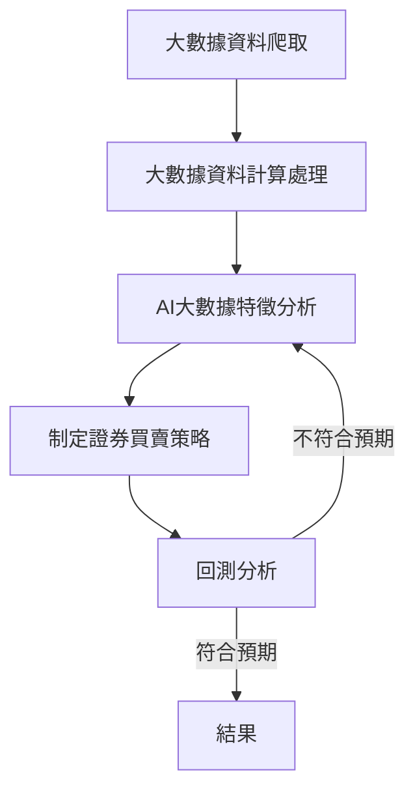

# Get-stock-data-and-calculate
取得台股數據以及計算技術指標
- [x] 大數據資料爬取 - **目前暫定只利用技術面分析，等未來整個架構完成後再加入籌碼面跟基本面。**
  - [x] 技術面 
    - [x] 個股開盤價(Open)、最高價(High)、最低價(Low)、收盤價(Close)、成交量(Volume)、成交金額(Amount)。
  - [ ] 籌碼面
    - [ ] 個股三大法人買賣超
    - [ ] 個股融資融券餘額
    - [ ] 個股券商進出
  - [ ] 基本面
    - [ ] 個股資本額與市值
    - [ ] 個股月營收
    - [ ] 個股股利配發
    - [ ] 個股本益比
    - [ ] 個股現金流量表 
  - [ ] 消息面 
- [x] 大數據資料計算處理
  - [x] 技術面
    - [x] 移動平均數 MA(Moving Average)
      - [x] 簡單移動平均數 SMA(Simple Moving Average)
      - [x] 指數平滑移動平均線 EMA(Exponential Smoothing Moving Average)
    - [x] 相對強弱指標 RSI(Relative Strength Index)
      - [x] 簡單平均RSI
      - [x] 指數平均RSI
    - [x] KDJ指標，又稱隨機指標 SO(Stochastic Oscillator)
      - [x] 未成熟隨機值 RSV(Row Stochastic Value)
    - [x] 指數平滑異同移動平均線 MACD(Moving Average Convergence & Divergence)
      - [x] 每日需求指數 DI(Demand Index)
      - [x] 離差值 DIF(Differential value)
      - [x] 震盪指標 OSC(Oscillator)
- [ ] Machine learning
  - [ ] Regression ->預測股價。ex:預測明日收盤價。
    - [ ] Model(y=b+wx) -> ex:y代表預測的明日收盤價、x是今日收盤價、b與w是未知參數。
  - [ ] Classification ->預測趨勢，定義的三個選項分別是，持有、買進、賣出。定義這三個選項的意義是，當趨勢從"持有"轉至"買進"時視為"做多訊號"，從"買進"轉為"持有"時視為"做多停利訊號"，從"持有"轉為"賣出"時視為"做空訊號"，從"賣出"轉為"持有"時視為"做空停利訊號"，從"買進"轉為"賣出"時"若有做多直接賣出，沒有做多也不做空，有可能是過熱反彈，或是大戶開始收割多單"，從"賣出"轉為"買進"時"有做空直接買回，沒有做空也不做多，有可能是過冷反彈，或是大戶開始收割空單"，僅在訊號轉折的時候做買進賣出的動作，訊號持續為同一種的時候不做買賣。
  - [ ] Structured learning ->創造??(目前沒什麼想法)
- [ ] AI數據分析與回測分析
  - [x] numpy基礎學習
  - [x] pandas基礎學習
  - [x] mplfinance基礎學習
  - [ ] 資料回測分析
- [ ] 證券買賣策略 - **參考分析結果制定策略**
  - [ ] 買進、持有、賣出訊號制定 ex:連續站上五日線兩天買進，股價近五日震幅小於5%持有，股價跌破五日線賣出。

#### 流程圖

#### 常用技術指標計算公式
T代表幾筆資料，通常是以天為單位，所以幾T也可以代表幾天的意思，也可以用1分鐘為1T的單位。
|技術指標|
說明
|計算公式|
|:-:|---|:-:|
| MA均線  | MA均線，最常使用的技術指標，最簡單也最好理解，五日均線就是將近五日收盤價相加除以五，常用的天數為5日、10日、20日、60日、120日、240日，這裡的日指的是有開盤的交易日。  | 近T日成交價相加/T|
| RSI指標  | RSI指標，常用技術指標之一，以RSI之高低來決定買賣時機是根據漲久必跌，跌久必漲之原則。以RSI作為買賣研判時，通常會設定區域界線。RSI指標呈現「一段時間內股價買盤與賣盤力量強弱比例」，評估力量是相對平衡還是懸殊。RSI範圍0至100，在RSI值高於50時表示漲勢大於跌勢，低於50表示跌勢大於漲勢，RSI大於80代表市場可能過熱超買，RSI小於20代表市場可能過冷超賣。連續維持在80以上或是20以下又可稱為鈍化，趨勢已定將會連漲或連跌，直到RSI回到80~20的範圍為止。RSI又分為簡單型與指數型，簡單型反應的太快，因此有了指數型的版本，目前主流是使用指數型，常用天數是RSI6、RSI12、RSI5、RSI10。  | (T日內平均漲幅)/(T日內平均漲幅+T日內平均跌幅)，指數化，(最新日漲幅-前一日平均漲幅)/T、(最新日跌幅-前一日平均跌幅)/T，並在執行一次前面的公式，就可得到指數化數據。|
| KDJ指標   | KDJ指標，常用技術指標之一，藉由比較收盤價格和價格的波動範圍，預測價格趨勢何時逆轉。KD指標呈現「最新股價的相對高低位置」，估股價目前處於相對高點或低點。KD值範圍0至100，D值大於80超買區，為高檔超買訊號，代表多頭強勢，市場過熱，隨時可能回檔或下跌，但還要注意反轉，所以建議等出現死亡交叉後再賣出，D值小於20超賣區，為低檔超賣訊號，代表空頭強勢，市場過冷，隨時可能反彈或回升，但需考慮鈍化問題，所以建議等出現黃金交叉後再買進。要計算KD指標必須先計算RSV，K值是RSV指數化的數據，通常RSV使用的T是9天，D值又是K值指數化的數據，計算K值與D值公式一樣，J值定義為3K-2D或是2K-3D，因此J值範圍不是0至100。| RSV=(最新收盤價-最近T天最低價)/(最近T天最高價-最近T天最低價)，K=(前天K值乘上2/3)+(今日RSV值乘上1/3)，D值=(前天D值乘上2/3)+(今日K值乘上1/3)|
| MACD指標  | 指數平滑異同移動平均線，常用技術指標之一，用於研判股票價格變化的強度、方向、能量，以及趨勢周期，找出股價支撐與壓力，以便把握股票買進和賣出的時機。MACD是一種趨勢分析指標，不宜同時分析不同的市場環境。快線 DIF(差離值)，將兩條EMA線相減，得出的差額就是差離值(DIF)，代表短線EMA偏離長線EMA的情形。慢線 MACD (也稱DEM)，計算出DIF後，再取DIF的N日指數移動平均線EMA(一般使用9日天數)即得，就是把DIF再取一次平均，稱為MACD線或DEM，意思是短期與長期乖離程度的平均值。柱狀圖 DIF-MACD：一般會將DIF-MACD兩者相減，繪成柱狀圖(直方圖、棒狀圖)。當我們實際從線圖看MACD指標的時候，會發現指標上有快線、慢線、柱狀圖 這三個區塊。快線 = 12日EMA – 26日EMA。慢線 = 快線取9日EMA。柱狀圖 (直方圖) = 快線–慢線，EMA快慢線相減後，得出來的差額就是在MACD圖形看到的柱狀圖。MACD指標的黃金交叉：當柱狀圖由負翻正，快線往上突破慢線，被視為黃金交叉(預測市場會上漲)，表示後續可能會有一波漲幅，投資人通常視為買入信號。MACD指標的死亡交叉：當快線向下跌破慢線，也就是柱狀圖由正轉負，被視死亡交叉(預測市場會下跌)，表示後續可能會有一波跌幅可能，投資人通常視為賣出信號。|
每日需求指數(Demand Index，DI)，DI = (最高價 + 最低價 + 2 × 收盤價) ÷ 4。首日EMA12 = 12天內DI 總和 ÷ 12。

首日EMA26 = 26天內DI 總和 ÷ 26。

當日平滑修正值 EMA12 = [前一日EMA12 × (12 - 1) + 今日DI × 2] ÷ (12+1)簡化後 EMA12 = 前一日EMA12 × (11/13) + 今日DI × 2/13。

當日平滑修正值 EMA26 = [前一日EMA26 × (26 - 1) + 今日DI × 2] ÷ (26+1)簡化後 EMA26 = 前一日EMA26 × (25/27) + 今日DI × 2/27。

差離值DIF = 12日EMA - 26日EMA。

首日MACD = 9天內DIF總和 ÷ 9。

MACD = (前一日MACD × (9 - 1) + 今日DIF × 2) ÷ (9 + 1)簡化後 MACD = (前一日MACD × 8/10 + 今日DIF × 2/10。
OSC = DIF - MACD 。|
